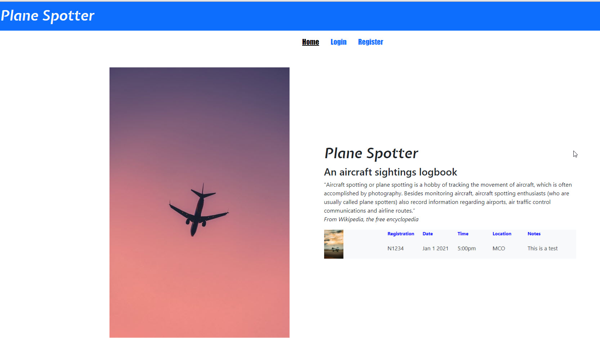
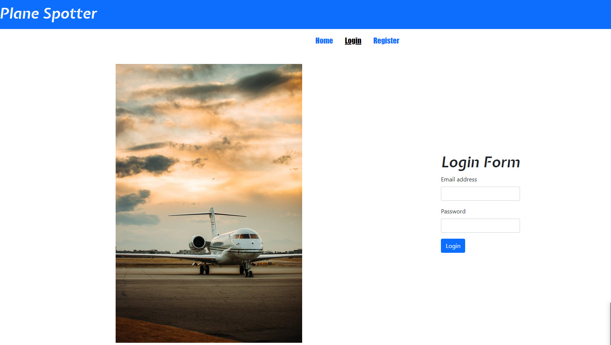
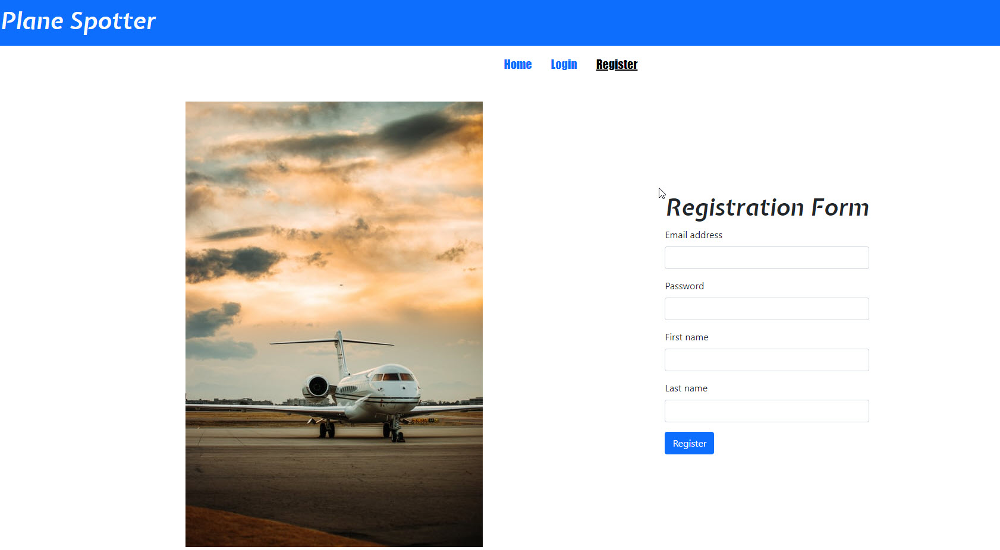
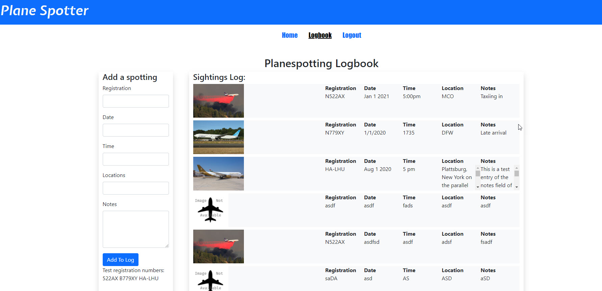
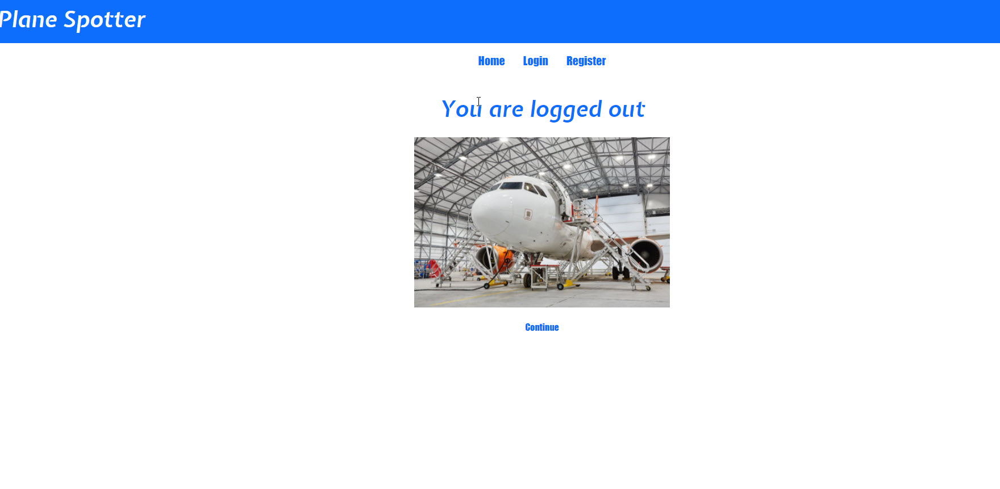
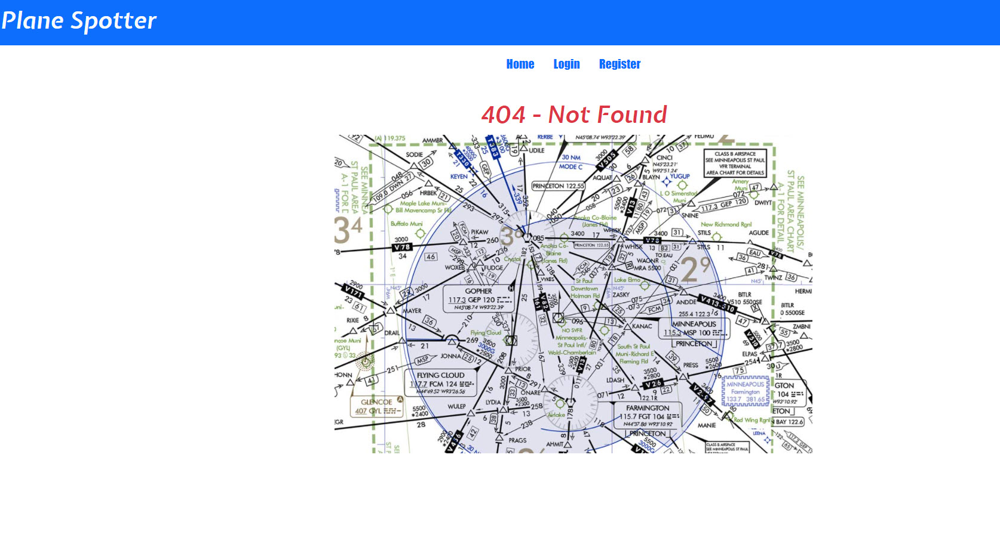

# Springboard Capstone 2 Project

## Project Name: Plane Spotter

## Developer: Philip Bailey

## Introduction

This project is a milestone in Springboards Software Engineering Bootcamp. The project is started at about 90-95% completion of the bootcamp and is designed for the developer to pull together and use concepts exposed in the bootcamp up to the project assignment.

## Description

The Plane Spotter website allows users to keep a logbook of specific aircraft sightings. This activity is central to the planespotting hobby. The user enters sighting criteria (registration number, date, time, location and notes) and the app uses an external API to search for and retrieve a photo of that specific aircraft. The sighting information is stored in a local database. All of the sighting logbook entries for the logged in user are displayed.

## Locations

### GitHub Repository: <https://github.com/ursawd/planespotter>

## Project Features

The Plane Spotter project is designed about a Node and Express backend accessing an external API for retrieving aircraft images. Sighting information is stored in PostgreSQL data and retrieved for each logged in user. The front UI is comprised of a JavaScript and React forntend. Access control is accomplished using the bcrypt password-hashing function. Layout and styling are accomplished using Bootstrap-5 and CSS. 

## Tech Stack

Node Express JavaScript React HTML CSS GIT Axios PostgreSQL bCrypt vscode

## API

### Aircraft Image API

- Returns the latest photo (by date taken) for an aircraft's registration.

  https://api.planespotters.net/pub/photos/reg/D-ABCD

- Returned data

```json
{
    photos: [
        {
            id:"000001",
            thumbnail:{
                src:"https:\/\/cdn.planespotters.net\/33130\/b-hoy-cathay-pacific-boeing-747-467_PlanespottersNet_000001_63e19431c7_t.jpg",
                size:{
                    width:200,
                    height:133
                }
            },
            thumbnail_large:{
                src:"https:\/\/cdn.planespotters.net\/33130\/b-hoy-cathay-pacific-boeing-747-467_PlanespottersNet_000001_63e19431c7_280.jpg",
                size:{
                    width:420,
                    height:280
                }
            },
            link:"https:\/\/www.planespotters.net\/photo\/000001\/b-hoy-cathay-pacific-boeing-747-467",
            photographer:"Thomas Noack"
        }
    ]
}
```

## User Flow

### Home Page


### Login


### Register


### Logbook


### Logout


### 404 Not Found


### Not Authorized

